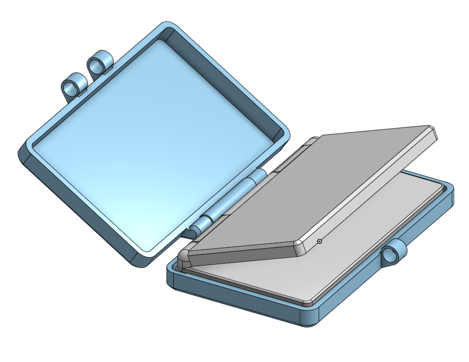
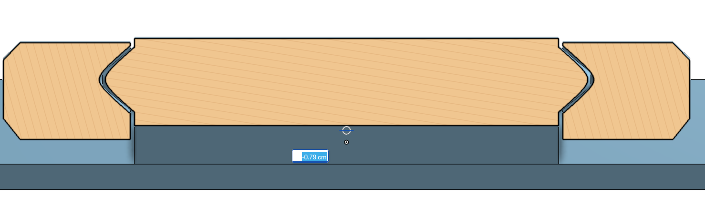

# Anbernic RG DS Case

Thanks to archer for giving me the RG DS, I will be moving to college soon and I was gonna take my DS, I love it so much I dont want it to scratch.

I dont js wanna yeet it in my bag and hope for the best

Also the stylus it comes w doesnt have a place to store it so I made thsi awesome printinplace 3D print case that can fit in normal 220x220 buildplate 3D pritners
___

___
This is js a simple quality of life project yall can use if you need it 

Heres the onshape link of the assembly 

https://cad.onshape.com/documents/7fec575934b8162eb5dd7295/w/418ba84d657b799356357c66/e/b8410227fefe3726ccd4e7db?renderMode=0&uiState=6aba7759ccf877284b1ce903

I will be printing it soon when my new filaments arrive :yay: (get it)
___

___
Heres the x ray view of the print in place hinge this is my first time designing this, im REALLY proud of how i was able to make a really cool lock by js using the stylus as lock : D

___
https://www.printables.com/model/1858863-anbernic-rg-ds-case
___
Printables link to the model : D
